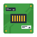

# Beysant Embedded

 

  
  

  
Batteries-included firmware for the Esp8266 targeted for home automation use cases.  Applications for connecting devices running the firmware to your network and controlling them - including an Open Source desktop application  - [Casnic Control](https://gitlab.com/bitsii/CasCon) - and mobile apps in the Google Play Store [Casnic Android App](https://play.google.com/store/apps/details?id=casnic.control&gl=US) and the Apple App Store [Casnic IOS App](https://apps.apple.com/us/app/cascon/id6458984046)

Built on the Arduino platform, written in [Beysant](https://github.com/bitsii/beBase) - an object oriented, garbage collected language that transpiles to C++.  Licensed under the [BSD-2-Clause](https://opensource.org/licenses/BSD-2-Clause) open source license.

## Prebuilt solutions

Common profiles are ready to go and can be customized through header configuration, including:

* Buttons
* Switches
* Lights (and)
* Dimmers

(with more planned)

## Features

* Device and [the application](https://gitlab.com/bitsii/CasCon) support provisioning, network changes, the full connectivity lifecycle - see [device setup](https://gitlab.com/bitsii/CasCon/-/wikis/Casnic#setting-up-a-new-device-and-adding-it-to-the-network) for more.
* Device announces itself over mDNS
* Configuration and usage supported an open TCP based protocol with an open source application - see [Casnic Control](https://gitlab.com/bitsii/CasCon)
* Reset mechanisms available - via button long-push (on devices with buttons) or specific power cycling pattern. See [device reset](https://gitlab.com/bitsii/CasCon/-/wikis/Casnic#resetting-a-device) for more.
* OTA updates from the web are supported
* A telnet addressable debug port can be enabled for use during development or for support
* Device profies can be configured for different control combinations and GPIO selection through configuration in a C++ header or via command over the network (if enabled)

## Pragmatic Security

Beysant Embedded tries to strike a good balance in the security space by enforcing only authorized use while remaining performant and reliable:

* Devices start with a unique configuration code - no default passwords.
* Authentication tokens are only exchanged in the clear during provisioning on the devices AP using the configuration codes.  Optional WPA support for the AP mode can provide isolation and encryption during this process if required.
* Secrets are not passed in the clear once provisioned and connected to the target wifi network.  Device commands are signed and validated with the shared secrets (the tokens) to protect against unauthorized use.  Signing includes the source network address to mitigate MITM attacks and time elements to resist replay attacks.
* Separate Administrative and Usage tokens (created during provisioning) are required for device control and use.  Users with the administrative token can configure the device and users with the usage token can only use the configured features (turn on and off, etc)  The application supports [sharing](https://gitlab.com/bitsii/CasCon/-/wikis/Casnic#sharing-a-device) to grant new users and devices access.

### Get the Hardware

* Some pre-built devices are supported, including the [Athom Plug V2 US](https://www.athom.tech/blank-1/tasmota-us-plug-v2) and the [Athom 7w Color Bulb](https://www.athom.tech/blank-1/color-bulb)
* Beysant Embedded should also work with most any Esp8266 development board.  2MB flash is recommended, though 1MB should work but will be unable to OTA.
* If your board has built in LED's you want to use make sure you know the GPIO/pin numbers for your configuration.
* Of course, many folks will be wiring up their own solution for hobby use - pick good GPIOs for your board, connect things up, and make a note of the pin numbers.
* If you are building a product and using the firmware on it, you should be able to follow the configuration spec below to prep your build for your product.

### Download a Genned Sketch

Grab the zip file from the latest release for the hardware you want to use - [beEmb Releases](https://github.com/bitsii/beEmb/releases)  They are named for the hardware they support, details are in the release description.  Unzip the file, it will create a directory with the source files and a .bin and .bin.gz firmware files for the device.

### Upload to hardware

If you are working with the prebuilt hardware you'll need to switch out the tasmota firmware for beEmb.  First get the device onto your wifi network [using it's wifi AP and the web interface](https://tasmota.github.io/docs/Getting-Started/#initial-configuration).  It will give you a link for the device on your wifi network (with it's address), be sure to note the address and follow the link (you'll have to reconnect to your own wifi network).  Then [download tasmota-minimal.bin.gz](https://ota.tasmota.com/tasmota/release/) from the latest release nad upload it to your device via firmware update / upload.  Now you are ready to upload the .bin.gz which you downloaded and prepared in the previous step.

### Provision and use the device

[Grab the CasCon App](https://gitlab.com/bitsii/CasCon/-/wikis/Casnic#installing-the-app)
[Use it to setup your device](https://gitlab.com/bitsii/CasCon/-/wikis/Casnic#setting-up-a-new-device-and-adding-it-to-the-network)
Here's a video for using the more secure CasnicU mode [Setting up a beEmb device with an Unshared key](https://www.youtube.com/watch?v=Vu9xA3vmt7s), and here is a video for the simpler open mode with CasnicO [Setting up a beEmb device with Open Mode](https://www.youtube.com/watch?v=_SArX4tCcmw)

### Working with a development board or building your own binaries

With a development board you have connected you can work with the firmware via the Arduino IDE and serial console. A good place to start is with pfnodemcu

### Getting Ready

For this you'll need a working installation of the Arduino IDE, version 1.x or 2.x.

* If you don't have the IDE, see [here](https://support.arduino.cc/hc/en-us/articles/360019833020-Download-and-install-Arduino-IDE) (note, some experience with the ecosystem is expected...)
* You'll need to install the Esp8266 boards manager - in the Arduino IDE go to Preferences, find Additional boards manager urls and add http://arduino.esp8266.com/stable/package_esp8266com_index.json .  Tested with version 3.1.1.
* [More detailed instructions for adding the Esp8266 board manager here if you need it](https://randomnerdtutorials.com/how-to-install-esp8266-board-arduino-ide/)

When you've made your choice open the sketch (.ino) from the directory the pfnodemcu.zip was previusly downloaded and extracted to.

### Configure for build and upload

Then configure for the build, in the IDE change the following settings under the tools menu:

* Set the Board to Generic ESP8266 Module
* Set the Flash Size to 2MB (FS:64KB OTA:~992KB) (you can use 1MB FS:64KB if that's all your board has, but OTA won't work / it's a tight fit)
* Set the Flash mode to DOUT (Compatible)
* Set SSL Support to Basic SSL Ciphers
* Set C++ Exceptions to Enabled
* Set the Upload Speed to 460800
* Pick your Port to which you've connected the board via USB (If building firmware to upload via the network, you can skip this)
* Generally you set the Erase Flash to Only Sketch, unless you want to clear the provisioning on a development board (in which case you can pick All Flash Contents)

### Write the firmware

Finally, choose Sketch / Upload in the Arduino IDE to put it on your device.  If you are uploading over the network over OTA "Export Compiled Binary" instead (it will land in the sketch directory)  This can be uploaded instead of the prepackaged one (IF CORRECT FOR YOUR HARDWARE) in the final update from tasmota minimal to the firmware.

## Doing your Own Thing

There are two levels available to you - one option that works when you all you need to customize the combination of controls and their in-built configuration is to modify the config in the header and rebuild/reupload.  For this case it's sufficient to work with the directories contained in the downloaded .zip files.  Beyond that you can modify the code itself do to whatever you want - see Further Customization for starting points there.  [These instructions assume you've already completed a build and write to a device from here](#getting-ready)

### Pick your starter profile

Similar to [pick your profile](#pick-your-profile) Depending on the combination of controls you need pick the best sketch subdirectory.  You should understand your planned configuration (see [Choose your configuration](#choose-your-configuration) below) and target (a dev board or a prebuilt device) first.  Prebuilt devices need a profile without serial input (not ending with 's') as the serial input causes them to fail. There will be serial output for those if you do use them with a development board, but no input.  

Consider starting with pfnodemcu, but you can pick any profile you like.

### Choose your configuration

#### BESPEC_SW and BESPEC_CON

* Open BEH_4_Base.hpp in the Arduino IDE (it is in the chosen directory next to the *.ino sketch, it should be already in the IDE in the side menu or as a top tab)
* At the top of the file are the configuration options, with a good deal of explanation and examples.  Refer to the information there and the details below to perform your configuration.  You'll pick one BESPEC_SW and one BESPEC_CON to define your device.
* BESPEC_SW configures the device type information, it is a string with a ConfigVersion(currently 0).An identifier (short name for your device, <=10 char).the device version (num > 0, you control it to version your solution for updates).  Something like #define BESPEC_SW "0.LightSwch.99"  
* BESPEC_CON defines the controls and their order, sw is a switch, dim is a dimmer, bu is a button, and sic ties the state of one switch to another.  You should have at least one control (frequently that is all), but may have more if you have several components attached to different pins.  The leading number is a version for the definition, currently always 0.  Remaining controls are dot "." separated, with commas used to define other parameters that control understands (if any).  So  #define BESPEC_CON "0.sw.16.dim.2" would configure two controls, one on-off switch on pin 16, and one adjustable dimmer on pin 2 (those are the LED pins on a standard NodeMCU, fwiw).
* The spec for sw takes a pin parameter first and uses it to set 0 or 255 with an optional "direction" if on and off is reversed for your application.  So sw.16 sets 0 for "on" and 255 for "off" on pin 16.  To reverse the 0 and 255 values use sw.16,1 
* The spec for dim takes a pin parameter only, direction is not currently supported.  It understands on and off (and remembers the last level set, defaults to full on the first time).  It supports setting values between 0 and 254 for different light levels (0 is full on, 255 is not a dim level, it is off).
* The spec for button takes a number of parameters, it supports use both for turning on and off a switch control you have defined and resetting for a long push of a button.  bu.5,0,30,0,10000 would setup a button on pin 5, second parameter allows controlling what "on" means depending on how your button works, typical is 0 as here (1 is other option to reverse).  30 is the milliseconds the button must be held to be considered a "toggle event", the next value (0) is the position of the switch toggled by the short press of the button, this is the position in the list of controls separated by ., in this case 0, meaning a "sw" control was at the start of the config (before this bu control). If you have no sw control you want to manage with the button (maybe it is only for reset) you can put 0 in for the toggle event push time (where we have 30 here) and any value for the sw control (it's ignored). The last parameter is the length of a long push which will reset the device in milliseconds - so in this example 10 seconds (longer, like 30 seconds is better "for real") - 0 disables. The button does use pin input mode pullup on the specified pin to create a resistence - this is typically what's desired for buttons, be sure your hardware and configuration works with that (you should not have or need an additional resistor in the circuit).  "toggle" means, when the button is pushed the proper time for a toggle event, it will reverse the switch from it's current value, so an "on" switch goes off, an "off" switch goes on (as you'd expect)
* The spec for sic takes a pin to managed the on and off for first (like sw), then a direction parameter (same as sw direction parameter), then the position of the switch to "watch" in the order of controls (like bu).  It will then watch for that switch to turn off or on and match it's own state to that switch.  sic.16,0,0 would control pin 16, using the "standard direction" (0), looking at the first control in the configuration (which would need to be an sw) and matching it's state to that sw controls state.

#### Other Configuration elements

* BE_TCPCONSOLE can be set to "on" to enable the tcp console or "off" to disable.  If enabled the device will listen on port 32259 - you can telnet to this port to view most of the console output (everything from the Beysant language "print" statements, lower level Arduino console messages are not presently sent there).  The session is read only / just for viewing debug information.

### If you want to make it your own

You can copy the directory to a new name if you like, rename the .ino file to the name of your new directory, and go to town.  so 

cp -R pfnodemcu pfmyprofile;mv pfmyprofile/pfnodemcu.ino pfmyprofile/pfmyprofile.ino 

### Further Customization

If you need your controls to behave differently than they do out of the box, or you want to create your own new controls, you'll also need to setup a Beysant development environment and checkout/modify/build the actual project (the downloaded sketches are pre-generated and only support configuration based customization - [you'll need to have the above Arduino environment setup and working](#getting-ready), and then you can go further with the instructions below)

For this approach you won't be using the downloaded .zip files but you will want to checkout the [beEmb git repo](https://github.com/bitsii/beEmb) into a working directory - you'll want a dedicated parent diretory as other directories will need to live alongside the beEmb one.

Next you need to setup the Beysant language, see [The Beysant Project](https://github.com/bitsii/beBase) for that.  If must be a peer directory to where you checked out beEmb in [Check it out](#check-it-out) (e.g. both beEmb and beBase share the same parent directory) The java environment is sufficient (you will be generating C++ code, but the Beysant Build process will do so from it's self-hosted java edition).  There are some limitations on Beysant when running with beEmb due to the teeny tiny nature of microcontrollers - the base library is greatly cut down (only List containers, no Maps or LinkedLists/Stacks), exceptions are not translated back into Beysant line numbers (but you can find them from the stack trace lines by opening the generated code).  Invocation and introspection (invoke, "can") and variadic behavior is not available.  Both static and dynamic call dispatch and garbage collection are available, however.

When working in this mode you should setup your configuration for BESPEC_SW and BESPEC_CON in the confs/profilename.hpp file BEFORE running the generator script instead of afterwards in the BEH_4_Base.hpp as the latter will be over written at every generation with the contents of the former. Run the appropriate script, it should generate the code.  Look at the BC.be, DC.be, SC.be, SIC.be files for the control code.  SH.be is the "main app code", other files are there for the Wifi, etc.  You may need to work with the code a bit to learn how it works, feel free to reach out with questions.  When you make changes re-run the appropriate generator script to regenerate the C++ for the Arduino IDE, it will generate into the ard subdirectory in the project.  When you are ready to build and upload open the Arduino IDE, open the sketch in the subdirectory of the project for the script that you ran (see above), and choose Sketch/Upload to upload the sketch to the board as you normally would.

### If you want to make it your own

To clone one of the existing profiles into a new name you should find the script file in "scripts" subdirectory, copy it to a name of your chosing in that directory (so scripts/pfnodemcu.sh -> scripts/pfmyprofile.sh), and do the same for the conf file in the confs directory (so confs/pfnodemcu.hpp -> confs/pfmyprofile.hpp).  Edit your script file and change the APPBLDNM environment variable to your new profile name (pfmyprofile) then setup your conf in the hpp profile and run your script, output and arduino sketch will be in pfmyprofile/ subdirectory as with the initial profile.

## Be Careful

Use of this information and the software is entirely at your own risk.  As with any interaction between software and something "acting in the real world" or "running electricity around", be sure system failure or unexpected behavior cannot result in harm or injury to anyone or anything.

## Credits

The official list of Beysant Embedded Authors:

Craig Welch <bitsiiway@gmail.com>
